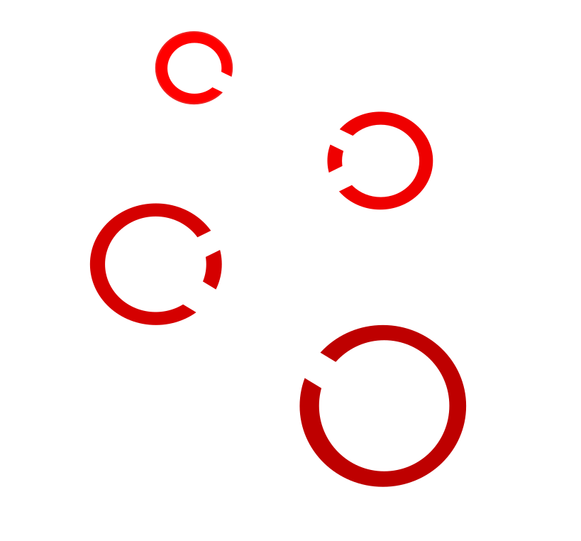

  

# Plex

Plex is a public and semi open source code bot made to just work. It has many levels of configurabilty and many features. It is coded using [Discord.js](https://discord.js.org) and [MongoDB](https://mongodb.com) by a team of developers lead by [carterdacat](https://github.com/carterdacat).

## Features

### Configuration Options

* Prefix: The Prefix the bot responds to. Default: !
* Nickname: The nickname of the bot. Default: Plex
* Responses: Messages the bot will respond to
* Ping command
